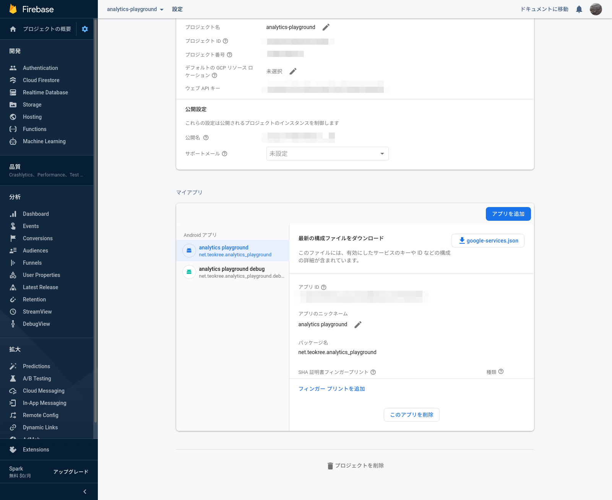
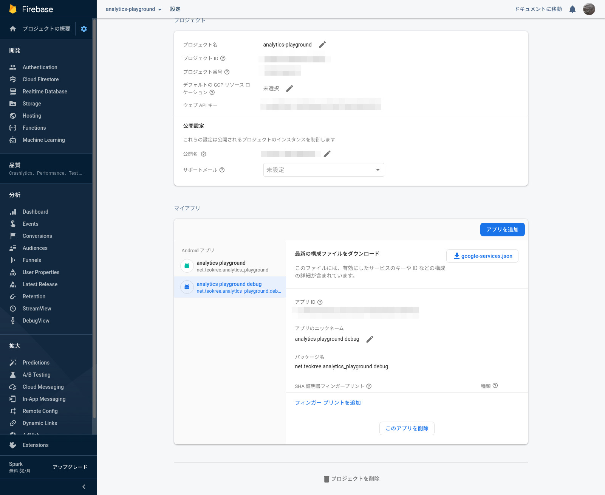
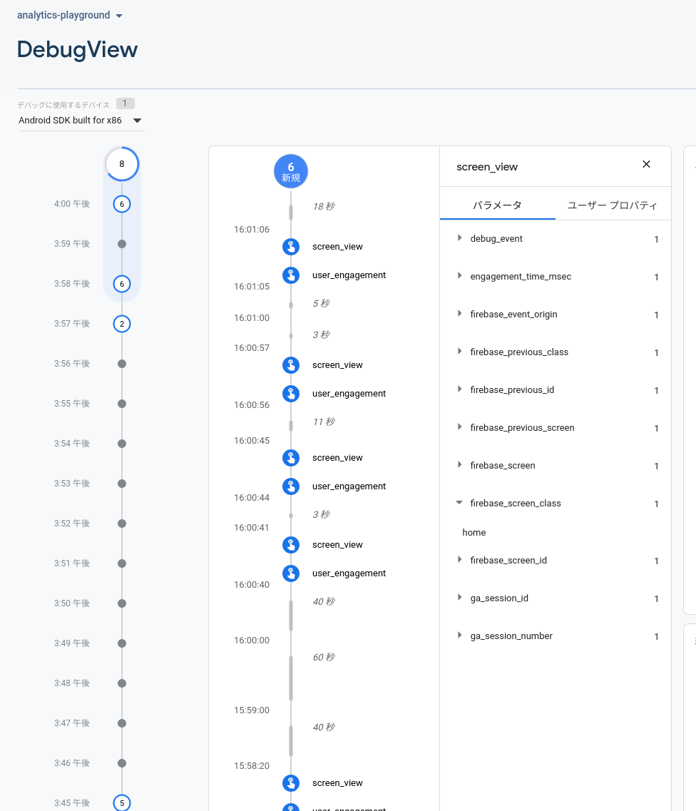
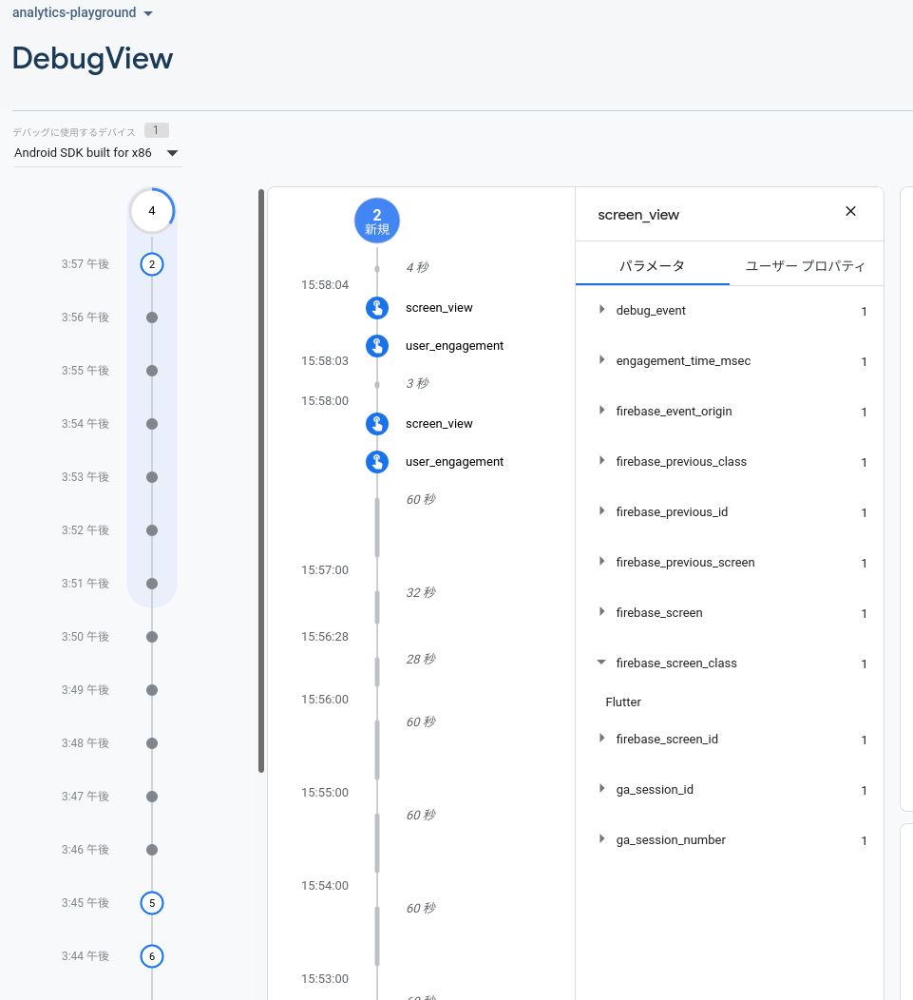

# analytics_playground

Flutter/Android環境にてGoogleアナリティクスを検証した際のメモ書き

# debug/releaseビルドでアナリティクス情報を分ける

パッケージの導入手順は割愛。  
日本語翻訳されているほうは情報が古いことが多いので英語で読んだほうが良い。  

## 参考リンク

- Flutter アプリに Firebase を追加する : https://firebase.google.com/docs/flutter/setup?hl=ja#configure_an_android_app

## (1) debugビルド時にアプリケーションID末尾に.debugを付与する

**android/app/build.gradle**の**android/buildTypes**に以下を追記する。

```
debug {
    applicationIdSuffix ".debug"
}
```

### 参考リンク

- ビルド バリアントの設定 | Android Developers : https://developer.android.com/studio/build/build-variants?hl=ja

## (2) Firebaseプロジェクトにアプリを2つ作成する

### releaseビルド用



**google-services.json**は**android/app/src/release**以下に配置する。
**android/app/src/release**ディレクトリが存在しない場合は作成する。

## debugビルド用

パッケージ名はdebugビルド時のアプリケーションIDに合わせる。



**google-services.json**は**android/app/src/debug**以下に配置する。

# debugビルド時にDebugViewが記録されない

アナリティクスのデバッグモードを有効にする設定が必要。

```
# Androidの場合
$ adb shell setprop debug.firebase.analytics.app <package_name>
```

## adbコマンドが存在しない場合

パスが通っていないと思われる。

```
# 各自の環境に合わせること
$ export PATH=$PATH:"$HOME/Android/Sdk/platform-tools"
```

## 参考

- DebugView でアナリティクスの設定を検証する - Firebase ヘルプ : https://support.google.com/firebase/answer/7201382?hl=ja

# CustomFirebaseAnalyticsObserverについて

標準の**FirebaseAnalyticsObserver**を使用すると**screen_class**が**Flutter**で固定になってしまうため**RouteSettings#name**と同じにするようにカスタムしたもの。

**CustomFirebaseAnalyticsObserver**で記録した例


**FirebaseAnalyticsObserver**で記録した例


